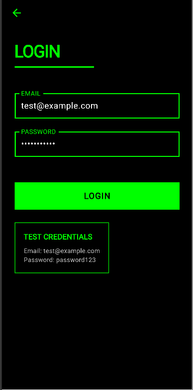

# HumblePOS - Authentication System

A full-stack authentication system with Flask backend and Flutter frontend. Features JWT-based authentication, user profile management, and a minimal De Stijl-inspired design with green and black color scheme.

## Screenshots

| Welcome Screen | Login Screen | Update Profile |
|---------------|--------------|----------------|
|  |  |  |

## Tech Stack

**Backend:**
- Python 3.8+
- Flask (REST API)
- MySQL
- JWT Authentication
- SQLAlchemy ORM

**Frontend:**
- Flutter
- Dart
- HTTP package
- Material Design

## Project Structure

```
humblepos/
├── py_backend/           # Flask API
│   ├── app.py
│   ├── config.py
│   ├── models.py
│   ├── routes/
│   ├── utils/
│   └── requirements.txt
├── flutter_frontend/     # Flutter app
│   └── lib/
│       ├── main.dart
│       ├── screens.dart
│       └── api_service.dart
└── images/              # Screenshots
    ├── welcome.png
    ├── login.png
    └── update.png
```

## Backend Setup

### Prerequisites

- Python 3.8 or higher
- MySQL 8.0 or higher
- pip

### Installation

1. Navigate to backend directory:
```bash
cd py_backend
```

2. Create virtual environment:
```bash
python -m venv venv
source venv/bin/activate  # On Windows: venv\Scripts\activate
```

3. Install dependencies:
```bash
pip install -r requirements.txt
```

4. Configure environment variables:

Copy `.env.example` to `.env` and update:
```bash
cp .env.example .env
```

Edit `.env`:
```env
DB_HOST=localhost
DB_PORT=3306
DB_USER=root
DB_PASSWORD=root
DB_NAME=ysw_data

SECRET_KEY=your-secret-key-here
JWT_SECRET_KEY=your-jwt-secret-key-here
```

5. Generate secure keys:
```bash
python generate_keys.py
```

6. Create MySQL database:
```sql
CREATE DATABASE ysw_data CHARACTER SET utf8mb4 COLLATE utf8mb4_unicode_ci;
```

7. Check database schema:
```bash
python check_database.py
```

8. If needed, run migration:
```bash
python migrate_database.py
```

9. Create test users:
```bash
python seed.py
```

10. Start the server:
```bash
python app.py
```

Server runs at: `http://localhost:5000`

## Frontend Setup

### Prerequisites

- Flutter SDK 3.0 or higher
- Android Studio / Xcode (for emulator)
- Chrome (for web)

### Installation

1. Navigate to frontend directory:
```bash
cd flutter_frontend
```

2. Get dependencies:
```bash
flutter pub get
```

3. Configure API URL:

Open `lib/api_service.dart` and update `baseUrl`:

**For Android Emulator:**
```dart
static const String baseUrl = 'http://10.0.2.2:5000';
```

**For iOS Simulator:**
```dart
static const String baseUrl = 'http://localhost:5000';
```

**For Physical Device:**
```dart
static const String baseUrl = 'http://YOUR_COMPUTER_IP:5000';
```

**For Web:**
```dart
static const String baseUrl = 'http://localhost:5000';
```

### Running the App

**On Emulator (Android/iOS):**

1. Start an emulator from Android Studio or Xcode
2. Run the app:
```bash
flutter run
```

**On Web:**
```bash
flutter run -d chrome
```

**On Physical Device:**

1. Enable USB debugging on your device
2. Connect via USB
3. Run:
```bash
flutter run
```

## API Testing with cURL

### Health Check
```bash
curl http://localhost:5000/health
```

Expected response:
```json
{
  "success": true,
  "message": "API is running",
  "status": "healthy",
  "database": "connected"
}
```

### Login
```bash
curl -X POST http://localhost:5000/auth/login \
  -H "Content-Type: application/json" \
  -d '{"email":"test@example.com","password":"password123"}'
```

Expected response:
```json
{
  "success": true,
  "message": "Login successful",
  "token": "eyJhbGciOiJIUzI1NiIsInR5cCI6IkpXVCJ9...",
  "user": {
    "id": "abc-123",
    "email": "test@example.com",
    "first_name": "Test",
    "last_name": "User",
    "updated_at": "2025-10-21T12:00:00"
  }
}
```

### Get Current User
```bash
curl http://localhost:5000/user/me \
  -H "Authorization: Bearer YOUR_TOKEN_HERE"
```

### Update Profile
```bash
curl -X PATCH http://localhost:5000/user/update \
  -H "Content-Type: application/json" \
  -H "Authorization: Bearer YOUR_TOKEN_HERE" \
  -d '{"first_name":"John","last_name":"Doe"}'
```

Expected response:
```json
{
  "success": true,
  "message": "User updated successfully",
  "user": {
    "id": "abc-123",
    "email": "test@example.com",
    "first_name": "John",
    "last_name": "Doe",
    "updated_at": "2025-10-21T12:05:00"
  }
}
```

## Test Credentials

Use these credentials to test the application:

```
Email:    test@example.com
Password: password123
```

Additional test users:
- `john.doe@example.com` / `password123`
- `jane.smith@example.com` / `password123`

## Features

**Authentication:**
- Secure password hashing (PBKDF2-SHA256)
- JWT token-based authentication
- Token expiration (24 hours)
- Input validation

**User Management:**
- User registration via seed script
- Profile viewing
- Profile updates (first name, last name)
- Automatic timestamp updates

**Security:**
- Password hashing with salt
- JWT signature verification
- SQL injection prevention via ORM
- CORS configuration
- Environment-based configuration

## API Endpoints

| Method | Endpoint | Description | Auth Required |
|--------|----------|-------------|---------------|
| GET | `/health` | Health check | No |
| GET | `/` | API information | No |
| POST | `/auth/login` | User login | No |
| GET | `/user/me` | Get current user | Yes |
| PATCH | `/user/update` | Update profile | Yes |

## Configuration

### Backend Environment Variables

| Variable | Description | Default |
|----------|-------------|---------|
| `DB_HOST` | MySQL host | `localhost` |
| `DB_PORT` | MySQL port | `3306` |
| `DB_USER` | MySQL user | `root` |
| `DB_PASSWORD` | MySQL password | Required |
| `DB_NAME` | Database name | `ysw_data` |
| `SECRET_KEY` | Flask secret key | Required |
| `JWT_SECRET_KEY` | JWT signing key | Uses SECRET_KEY |
| `FLASK_ENV` | Environment | `development` |
| `PORT` | Server port | `5000` |
| `CORS_ORIGINS` | Allowed origins | `*` |

### Frontend Configuration

Update `baseUrl` in `lib/api_service.dart` based on your target platform:

- **Android Emulator:** `http://10.0.2.2:5000`
- **iOS Simulator:** `http://localhost:5000`
- **Physical Device:** `http://[YOUR_IP]:5000`
- **Web:** `http://localhost:5000`

## Troubleshooting

### Backend Issues

**Database connection fails:**
```bash
# Check if MySQL is running
mysql -u root -p

# Verify database exists
mysql -u root -p -e "SHOW DATABASES;"

# Run migration if tables are missing
python migrate_database.py
```

**"Unknown column 'password'" error:**
```bash
# Add missing columns
python migrate_database.py
```

**Port 5000 already in use:**
```bash
# Change port in .env
PORT=5001
```

### Frontend Issues

**Connection refused:**
- Verify Flask backend is running
- Check API URL in `api_service.dart`
- For physical devices, use computer's IP address

**Hot reload not working:**
- Press `r` in terminal for hot reload
- Press `R` for full restart

## Development

### Backend Development

```bash
# Activate virtual environment
source venv/bin/activate  # Windows: venv\Scripts\activate

# Run with auto-reload
python app.py

# Run tests
pytest tests/ -v

# Check configuration
python validate_env.py
```

### Frontend Development

```bash
# Hot reload (press 'r' in terminal)
flutter run

# Run on specific device
flutter run -d chrome
flutter run -d emulator-5554

# Build for production
flutter build apk          # Android
flutter build ios          # iOS
flutter build web          # Web
```

## Database Schema

### Users Table

| Column | Type | Constraints |
|--------|------|-------------|
| id | VARCHAR(36) | PRIMARY KEY |
| email | VARCHAR(255) | UNIQUE, NOT NULL |
| password | VARCHAR(255) | NOT NULL (hashed) |
| first_name | VARCHAR(100) | NOT NULL |
| last_name | VARCHAR(100) | NOT NULL |
| updated_at | DATETIME | NOT NULL, AUTO UPDATE |

## License

MIT License

## Author

HumblePOS Development Team

## Support

For issues and questions:
- Check the troubleshooting section above
- Review backend logs in `logs/app.log`
- Verify configuration with `python validate_env.py`

## Quick Start Summary

**Backend:**
```bash
cd py_backend
python -m venv venv && source venv/bin/activate
pip install -r requirements.txt
python generate_keys.py
python migrate_database.py
python seed.py
python app.py
```

**Frontend:**
```bash
cd flutter_frontend
flutter pub get
# Update API URL in lib/api_service.dart
flutter run -d chrome
```

**Test:**
- Open app
- Login with `test@example.com` / `password123`
- View and update profile